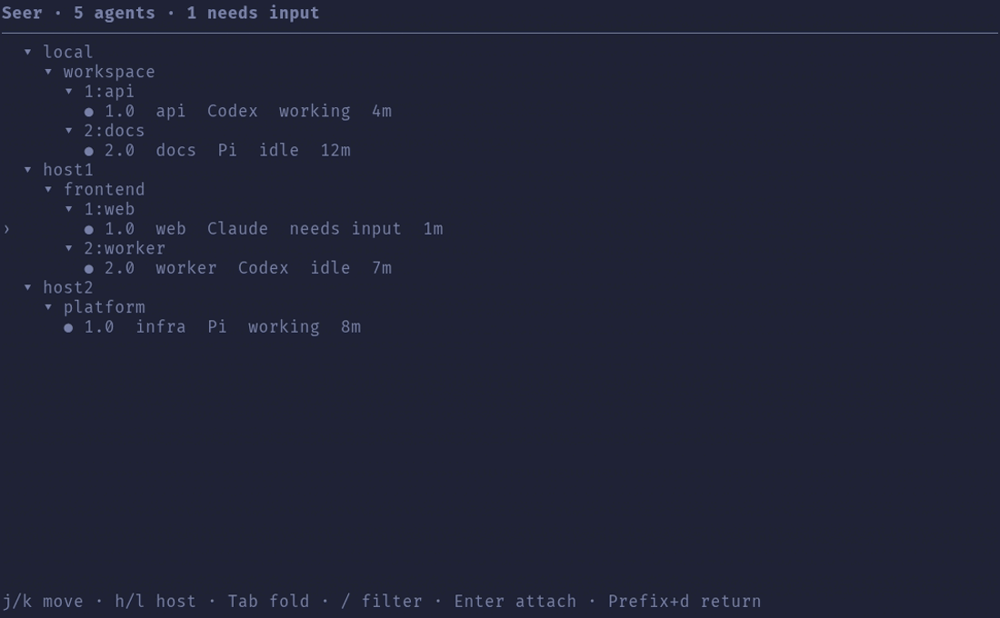

# Seer

A tmux dashboard for tracking coding agents across local and SSH sessions—working, idle, or waiting for input.



- Green — working
- Yellow — idle
- Blue — needs structured permission or question input
- Gray — untracked or offline

Seer supports Claude Code, Codex, and Pi. It shows only panes running agents and never sends input, stops, or restarts them.

> **Status:** early development. Binary releases and TPM installation are available for Linux x86_64 and Apple Silicon macOS.

## Install with TPM

Seer requires tmux 3.5 or newer. Add it after status/theme plugins and before TPM's final `run` line:

```tmux
set -g @plugin 'carlosarraes/tmux-seer'

# Optional SSH aliases from ~/.ssh/config
set -g @seer_hosts 'host1 host2'

run '~/.tmux/plugins/tpm/tpm'
```

Press `prefix + I`, then configure and check the agent integrations:

```sh
tmux-seer setup
tmux-seer doctor
```

Setup previews an exact diff and changes nothing until you approve it. Restart active agents afterward; Codex also requires trusting the new definitions through `/hooks`.

When upgrading from `0.0.x`, `prefix + I` replaces the legacy daemon automatically. Run `tmux-seer setup` and select configured remote integrations once so those hosts receive the matching `0.1.x` binary. Existing hook commands do not need to be reinstalled.

## Use

- `prefix + S` — quick popup
- `prefix + s` — full-screen dashboard

| Key | Action |
|---|---|
| `j` / `k`, `↑` / `↓` | Move |
| `h` / `l` | Previous or next online host |
| `Tab` | Fold or expand |
| `/` | Filter |
| `R` | Refresh now and reconcile stale agent state |
| `Enter` | Jump locally or attach remotely |
| `r` | Rename a session inline |
| `q`, `Esc` | Close |

When attached to a remote tmux session, press `prefix + d` to return to Seer. The remote session and its agents keep running.

## Remote hosts

Seer connects only to aliases listed in `@seer_hosts`; it never scans for machines. Configure non-interactive authentication in `~/.ssh/config`, for example:

```sshconfig
Host host1
  HostName 203.0.113.10
  User you
  IdentityFile ~/.ssh/id_ed25519
```

Run `tmux-seer setup` again after adding a host. The picker installs the matching Seer release and configures the selected integrations remotely.

<details>
<summary>Configuration</summary>

| tmux option | Default | Purpose |
|---|---:|---|
| `@seer_key` | `S` | Quick popup binding |
| `@seer_fullscreen_key` | `s` | Full-screen binding |
| `@seer_hosts` | empty | Space-separated SSH aliases |
| `@seer_popup_width` | `76` | Popup columns |
| `@seer_popup_height` | `70%` | Popup height |
| `@seer_remote_interval_ms` | `2000` | Remote refresh interval |
| `@seer_remote_max_backoff_ms` | `60000` | Maximum retry delay for an offline host |
| `@seer_notify_ms` | `4000` | Notification duration |
| `@seer_log_level` | `warn` | `warn`, `error`, or opt-in `debug` diagnostics |
| `@seer_binary` | auto | Binary path override |

Status colors use `@seer_color_working`, `@seer_color_idle`, `@seer_color_input`, and `@seer_color_offline`.

Hooks and popup leases use private runtime files rather than tmux options, so agent activity cannot block tmux or trigger status-theme redraws. Seer automatically removes stale pane records; `R` forces that reconciliation and retries every remote host immediately.

Pane topology and process discovery may lag by up to five seconds. Hook-driven state changes remain fast; use `R` when you need an immediate full rescan. Offline hosts back off to the configured retry limit instead of slowing healthy hosts.

For diagnostics:

```sh
tmux-seer doctor
tmux-seer logs
tmux-seer logs --follow
```

Logs rotate at 1 MiB and retain one previous file. They contain timing, host aliases, and errors—not prompts, transcripts, or terminal output.

</details>

<details>
<summary>Install without TPM</summary>

Download the latest checksummed binary:

```sh
curl -fsSL https://github.com/carlosarraes/tmux-seer/releases/latest/download/install.sh | sh
tmux-seer bootstrap
tmux-seer setup
```

Set `TMUX_SEER_VERSION` to pin a release or `TMUX_SEER_INSTALL_PATH` to choose another destination.

To build from source, install Rust 1.89 or newer, clone the repository, and run:

```sh
just build
tmux-seer bootstrap
tmux-seer setup
```

</details>

<details>
<summary>Uninstall</summary>

```sh
tmux-seer setup --uninstall
```

This removes only Seer-owned agent integrations. Remove the plugin entry separately through TPM.

</details>

<details>
<summary>Development</summary>

```sh
just check
```

Maintainers can publish from a clean tree with `just release 0.1.0`.

</details>

No license has been selected yet. No license is implied by the public repository.
